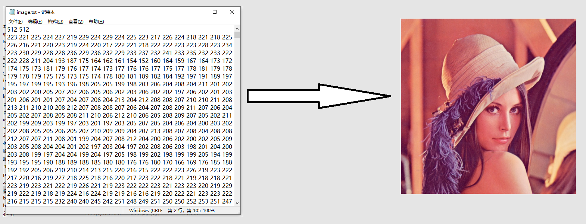
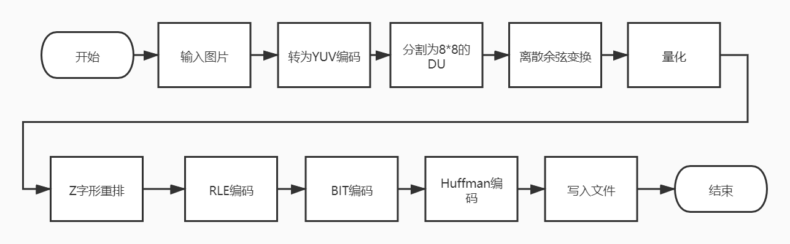
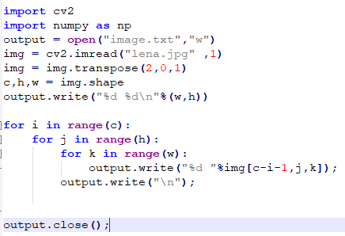
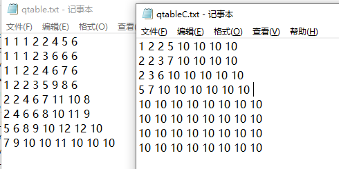

# JPEG编码与压缩

## 1.简介

本项目是图像处理与模式识别课程的作业，实现一个jpeg编码器，以原始图片数据（3维张量）为输入，对其进行jpeg编码与压缩，输出jpeg图片。

## 2.整体流程

各环节的具体实现细节，见 **JPEG编码与压缩.pdf** 

## 3.程序执行

#### 1）图片预处理

使用pretreat.py对lena.jpg进行预处理，将其转换为RGB格式的文本文件image.txt。

注意：lena.jpg的长宽需要都能被8整除。压缩包中的图片是512*512，符合条件，可以直接用。

#### 2）量化表

包含两张量化表，亮度和色度的量化表，分别存在qtable.txt和qtableC.txt中。image.txt，qtable.txt和qtableC.txt放在同一文件夹中。

#### 3）运行jpeg编码程序

执行jpeg.exe运行程序。运行程序后，输入上述文件所在文件夹的路径，输入压缩比率，接下来程序会开始进行编码，并生成output.jpeg文件。

## 4.执行效果

#### 1）图片编码

该编码程序可以成功进行jpeg编码

#### 2）不同压缩比率的对比

选用不同压缩率进行图片效果和图片大小的对比，并与原图片进行对比。

| 说明     | 大小  | 图片                                                         |
| -------- | ----- | ------------------------------------------------------------ |
| 压缩率=0 | 263KB |  |
| 压缩率=1 | 161KB |  |
| 压缩率=2 | 130KB |  |
| 压缩率=3 | 110KB |  |
| 压缩率=4 | 102KB |  |
| 压缩率=5 | 95KB  |  |
| jpeg原图 | 101KB |  |

随着压缩率提升，图片所占空间变小，图片质量变得更差。

但跟jpeg原图对比，占据同样甚至更少的空间，原图比我生成的图片质量要好很多。我认为原因在于，原图使用的是4\*2\*2的采样比，丢弃了更多色度信息，保留了更多亮度信息；而我使用的是1\*1\*1的采样比，图片在压缩时对亮度有很大损失，故降低了图片的质量。

## 5.参考资料

##### 相关博客：

- https://blog.csdn.net/qq_35413770/article/details/88064373

- https://github.com/shitouo/jpeg_tutorial/blob/master/doc/%E8%B7%9F%E6%88%91%E5%AF%ABjpeg%E8%A7%A3%E7%A2%BC%E5%99%A8%EF%BC%88%E4%B8%89%EF%BC%89%E8%AE%80%E5%8F%96%E9%87%8F%E5%8C%96%E8%A1%A8%E3%80%81%E9%9C%8D%E5%A4%AB%E6%9B%BC%E8%A1%A8.md

- http://itpcb.com/a/86738

- https://blog.csdn.net/yun_hen/article/details/78135122

- https://www.cnblogs.com/buaaxhzh/p/9119870.html

##### jpeg分析工具——JPEGsnoop

- https://blog.csdn.net/heibao111728/article/details/82840314